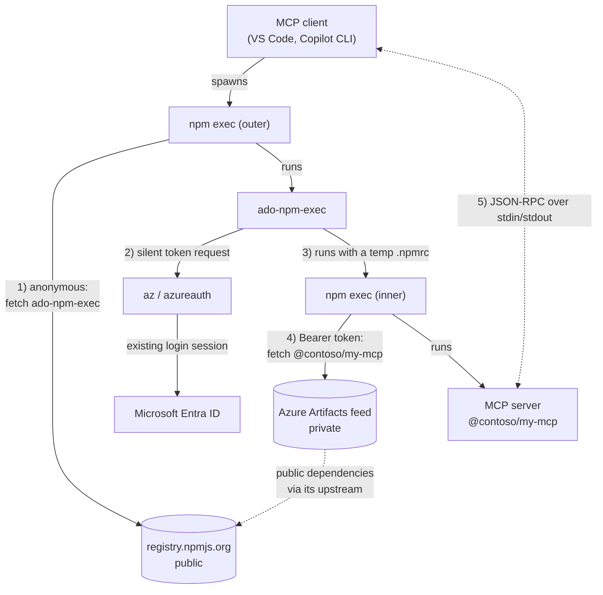
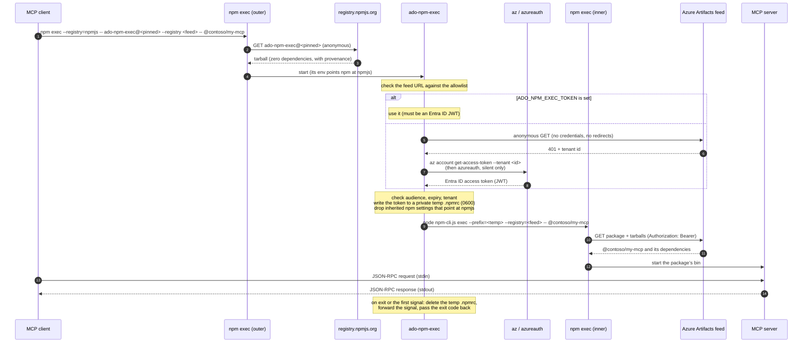

# ado-npm-exec

Run a package from a **private Azure DevOps (Azure Artifacts) npm feed** with
zero setup: no `.npmrc` edits, no PATs, no `vsts-npm-auth`. `ado-npm-exec` gets
a Microsoft Entra ID token silently from the Azure CLI (or `azureauth`), hands
it to npm through a short-lived private config file, and runs `npm exec`
against the feed.

It is built for **MCP stdio server configs** (VS Code, GitHub Copilot CLI and
other MCP clients), where stdout is the JSON-RPC channel and nothing may
prompt:

- never writes to stdout and never reads stdin; diagnostics go to stderr;
- zero runtime dependencies (it handles your Azure DevOps tokens, so its
  supply chain is just Node.js and npm);
- published from GitHub Actions with npm provenance.

## How it works

`ado-npm-exec` itself comes anonymously from the public npm registry. Your
package comes from the private feed, with a Microsoft Entra ID token that is
only ever sent to that feed. The inner npm talks to the feed alone; public
dependencies reach it through the feed's upstream sources.



Step by step:



## Quick start

1. Sign in once with the Azure CLI (the same session `az` and most Azure tools
   share):

   ```sh
   az login --allow-no-subscriptions
   ```

2. Add the server to your MCP config. Replace `<org>`, `<feed>` and the package
   spec, and **pin `ado-npm-exec` to an exact version** (see
   [Security model](#security-model)).

   **VS Code** (`.vscode/mcp.json` or the user-level `mcp.json`):

   ```json
   {
     "servers": {
       "my-mcp": {
         "type": "stdio",
         "command": "npm",
         "args": [
           "exec", "-y", "--prefix=~/", "--registry=https://registry.npmjs.org/",
           "--", "ado-npm-exec@0.1.0",
           "--registry", "https://pkgs.dev.azure.com/<org>/_packaging/<feed>/npm/registry/",
           "--", "@contoso/my-mcp@latest", "--some-server-flag"
         ]
       }
     }
   }
   ```

   **GitHub Copilot CLI** (`~/.copilot/mcp-config.json`):

   ```json
   {
     "mcpServers": {
       "my-mcp": {
         "type": "local",
         "command": "npm",
         "args": [
           "exec", "-y", "--prefix=~/", "--registry=https://registry.npmjs.org/",
           "--", "ado-npm-exec@0.1.0",
           "--registry", "https://pkgs.dev.azure.com/<org>/_packaging/<feed>/npm/registry/",
           "--", "@contoso/my-mcp@latest"
         ],
         "tools": ["*"]
       }
     }
   }
   ```

What the outer arguments do:

| Argument | Why |
| --- | --- |
| `exec -y` | Fetch and run `ado-npm-exec` without prompting. |
| `--prefix=~/` | Makes your home directory npm's project root for this one command. Without it, an `ado-npm-exec` copy in the workspace's `node_modules` could be run instead of the published package, and the workspace's `.npmrc` would apply. npm expands `~/` itself. |
| `--registry=https://registry.npmjs.org/` | `ado-npm-exec` lives on the public registry, whatever your default registry is. |
| `ado-npm-exec@<exact version>` | Pinned. Never `@latest` for a tool that handles your tokens. |

Everything after `ado-npm-exec@…` is for `ado-npm-exec` itself: the feed URL,
then the package spec and the arguments for that package.

## Usage

```text
ado-npm-exec [options] --registry <feed-url> [--] <package-spec> [args...]
ado-npm-exec [options] <feed-url> <package-spec> [args...]
```

Options are only recognized **before** the feed URL / package spec; everything
after the package spec is passed to the package unchanged.

| Option | Description |
| --- | --- |
| `--registry <url>` | Azure Artifacts npm feed URL (see [accepted URLs](#accepted-feed-urls)). |
| `--tenant <guid>` | Entra ID tenant of the feed's organization. Default: discovered from the feed. |
| `--verbose` | Print diagnostics to stderr (tokens are always redacted). |
| `-h`, `--help` / `-v`, `--version` | Help / version, printed to stderr. |

| Environment variable | Description |
| --- | --- |
| `ADO_NPM_EXEC_TOKEN` | Use this Entra ID access token (a JWT for Azure DevOps) instead of az/azureauth. PATs are rejected. |
| `ADO_NPM_EXEC_TENANT` | Same as `--tenant`. |
| `ADO_NPM_EXEC_VERBOSE=1` | Same as `--verbose`. |
| `ADO_NPM_EXEC_TIMEOUT_MS` | Timeout per token provider, 1000 to 120000 ms (default 10000). |

`<package-spec>` must be a registry spec: `[@scope/]name[@version|range|tag]`.
URLs, paths, git specs and `npm:` aliases are refused because they would not
come from the feed.

Exit codes: the package's own exit code when it runs; `2` usage or invalid
URL/spec; `3` no usable token; `4` npm not found; `1` unexpected error. If the
package is killed by a signal, `ado-npm-exec` ends the same way (POSIX).

### Accepted feed URLs

Only `https` URLs of Azure Artifacts npm feeds are accepted:

```text
https://pkgs.dev.azure.com/<org>[/<project>]/_packaging/<feed>[@<view>]/npm/registry/
https://<org>.pkgs.visualstudio.com[/<project>]/_packaging/<feed>[@<view>]/npm/registry/
```

Anything else (other hosts, look-alike hosts, `http`, ports, credentials,
query strings, fragments, encoded characters other than `%20`, dot segments) is
rejected **before** a token is acquired.

## Authentication

Only **Microsoft Entra ID access tokens** for the Azure DevOps resource
(`499b84ac-1321-427f-aa17-267ca6975798`) are used. Personal access tokens are
deliberately not supported. Sources are tried in this order, each with a
timeout; the first usable token wins:

1. **`ADO_NPM_EXEC_TOKEN`**, when set. It must be an Entra ID JWT; anything else
   fails the run instead of silently falling back.
2. **Azure CLI**: `az account get-access-token --resource 499b84ac-… --tenant <tenant>`.
   Uses your `az login` session (user, service principal or managed identity)
   and never prompts.
3. **azureauth**: `azureauth ado token --mode broker --output headervalue --tenant <tenant>`,
   run with `AZUREAUTH_NO_USER=1` so it can only work silently (cached
   account, the OS broker on macOS and Linux, Integrated Windows Auth on
   Windows). Its PAT sources (`AZUREAUTH_ADO_PAT`, `SYSTEM_ACCESSTOKEN`) are
   removed from its environment and a `Basic` (PAT) answer is rejected.

Each token is sanity-checked locally before use: audience must be Azure DevOps,
it must not expire within 2 minutes, and its tenant must match the feed's. A
token that fails a check falls through to the next source. The signature is
not checked locally; Azure DevOps checks it.

**Tenant discovery.** An anonymous request to the feed returns `401` with the
organization's tenant (`x-vss-resourcetenant`, or the `authorization_uri` of
the `Bearer` challenge). That tenant is passed to `az`/`azureauth` so you get a
token for the right directory even if your default `az` tenant is another one.
The request carries no credentials and does not follow redirects. Pass
`--tenant` to skip it (for example behind a proxy that blocks it).

| | Azure CLI (`az`) | `azureauth ado token` |
| --- | --- | --- |
| Returns | Entra ID token only | A PAT from env if present, else an Entra ID token (PAT paths are disabled by ado-npm-exec) |
| Session | `az login` | Its own cache or the OS broker |
| Silent | Always | Only with `AZUREAUTH_NO_USER=1` (set by ado-npm-exec) |
| Typical setup | `az login --allow-no-subscriptions` | Preinstalled on some managed developer machines |

## Security model

**Threat model.** An MCP config is already code execution: whoever writes it
chooses the command. What `ado-npm-exec` adds is a credential, so it must make
sure the token only ever reaches Azure DevOps, and that it runs what you asked
for from the feed you named.

- **Host allowlist.** The token is only used for an `https` Azure Artifacts feed
  on `pkgs.dev.azure.com` or `<org>.pkgs.visualstudio.com`. Those hosts are
  operated by Microsoft; an organization owner (even of an attacker-created
  organization) cannot read the credentials sent to them. A token issued for a
  different tenant is simply rejected by Azure DevOps. If you work with several
  tenants, pin `--tenant`.
- **Never in argv, never long-lived.** The token is written to a `.npmrc` inside
  a fresh `mkdtemp` directory (mode `0700`, file `0600`, created exclusively)
  and handed to npm via `npm_config_userconfig`. The directory is deleted when
  npm exits, on errors, and **immediately on the first SIGINT/SIGTERM/SIGHUP**,
  before the signal is forwarded, so a client escalating to SIGKILL does not
  leave it behind.
- **Path-scoped auth.** The file holds `registry=<feed>`, `@<scope>:registry=<feed>`
  and `//<host>/<path>/:_authToken=<token>`. npm only sends it to that feed (and,
  for Azure Artifacts' GUID-path tarball URLs, to the same host).
- **Isolated npm config.** The outer `npm exec` exports its config as
  `npm_config_*` variables, and environment config beats config files. Before
  the inner npm starts, `ado-npm-exec` removes the inherited registry,
  userconfig, prefix and exec-related settings, every `npm_config_//<feed host>…`
  credential and the package scope's registry override. Your npm cache, proxy
  and CA settings are kept.
- **Isolated project.** The inner npm runs with `--prefix=<private temp dir>`. A
  `.npmrc` in the current directory therefore cannot override the token, and a
  same-name package in a local `node_modules` (or installed globally) cannot be
  run instead of the feed's. The package still runs in your current directory.
- **Hardened npm flags**, at command-line precedence: `--yes`, `--strict-ssl=true`,
  `--foreground-scripts=false` (install scripts cannot write to the MCP
  channel or read from it), `--json=false` (npm errors never go to stdout),
  `--update-notifier=false --audit=false --fund=false`.
- **No shell for npm.** npm runs as `node npm-cli.js …` (located from the npm
  that launched `ado-npm-exec`, the Node.js installation, or `PATH`), avoiding
  Windows `npm.cmd` quoting problems.
- **Safe tool lookup.** `az`/`azureauth` are looked up only in absolute `PATH`
  entries, so a workspace cannot plant one. They run without stdin, their output
  is captured (never forwarded to stdout), and a timeout kills the whole process
  tree.
- **Zero dependencies, plain JavaScript.** What is published is exactly the
  reviewed source (no build step), with npm provenance linking it to the
  GitHub Actions run that published it.
- **Pin the version.** Use `ado-npm-exec@<exact version>` in configs, never
  `@latest`: a tool that handles tokens should only change when you decide.

## Token lifetime

Entra ID access tokens live about 60 to 90 minutes. npm reads the token when it
starts, which is all `ado-npm-exec` needs: the package is downloaded and
started. The launched program inherits `npm_config_userconfig`,
`npm_config_registry` and `npm_config_prefix` pointing at the temporary state.
If it runs npm itself later, that npm loses access once the token expires or
the session ends. **Programs that need the feed later must get their own
credentials.** There is no refresh daemon by design.

## Limitations

- **Developer machines only.** CI pipelines are a non-goal (`SYSTEM_ACCESSTOKEN`
  is not used); use a pipeline-specific setup there.
- **Transitive dependencies come from the feed too.** `registry=` points at the
  feed, so the feed needs an upstream source (for example npmjs) for public
  dependencies. Your `~/.npmrc` is not loaded by the inner npm; plain settings
  still arrive through the outer `npm exec` environment.
- **npm's exec cache is keyed by the spec string, not the registry.** If the
  exact same spec (for example `@contoso/tool@1.2.3`) was ever run from a
  different registry, npm may reuse that cached copy. Claim your package scope
  on npmjs so nobody else can publish under it.
- **Windows signals.** There are no POSIX signals on Windows; Ctrl+C reaches npm
  through the console, and MCP clients normally stop servers by closing stdin.
- **Crash or SIGKILL** of `ado-npm-exec` itself (before any other signal) leaves
  its temp directory behind in the OS temp folder; the token in it expires
  within about 90 minutes.

## Troubleshooting

Run the same command in a terminal with `--verbose` (or set
`ADO_NPM_EXEC_VERBOSE=1` in the MCP config's `env`):

```sh
npm exec -y --registry=https://registry.npmjs.org/ -- ado-npm-exec@0.1.0 --verbose \
  --registry https://pkgs.dev.azure.com/contoso/_packaging/feed/npm/registry/ \
  -- @contoso/my-mcp@latest --version
```

- **`could not acquire a Microsoft Entra ID token`**: run the suggested
  `az login --tenant <tenant> --allow-no-subscriptions`.
- **`E401`/`E403` from npm**: your account lacks *Reader* on the feed (or its
  upstream view).
- **Tenant discovery fails** (proxies; Node's `fetch` does not use
  `HTTPS_PROXY`): pass `--tenant <guid>`.
- **TLS errors behind an intercepting proxy**: configure `cafile` or
  `NODE_EXTRA_CA_CERTS`; `strict-ssl` is always on for the inner npm.
- **`organization is not connected to Microsoft Entra ID`**: only Entra-backed
  organizations are supported.

## Development

```sh
npm ci
npm test            # node:test, no network (one test serves a registry on localhost)
npm run typecheck   # tsc --checkJs over the JSDoc types
```

### Smoke test against a real feed (manual)

Uses your real `az`/`azureauth` login; not run in CI:

```sh
SMOKE_REGISTRY=https://pkgs.dev.azure.com/<org>/_packaging/<feed>/npm/registry/ \
SMOKE_SPEC=semver@7.6.3 SMOKE_ARGS="1.2.3" \
node scripts/smoke.mjs

# MCP stdio servers: sends `initialize` and expects the response on stdout first
SMOKE_REGISTRY=… SMOKE_SPEC=@contoso/my-mcp@latest SMOKE_MCP=1 node scripts/smoke.mjs
```

It passes when the run succeeds, stdout holds only the package's output, and no
temp directory is left behind.

## Publishing

Releases are published by `.github/workflows/publish.yml` when a GitHub release
is published. The workflow uses npm trusted publishing (OIDC) with provenance:
no npm token is stored in the repository.

1. The first version must be published once by hand, because npm only lets you
   add a trusted publisher to an existing package. Provenance can only be
   generated in CI, so turn it off for this one manual publish:
   `npm publish --access public --provenance=false`.
2. On npmjs.com, package settings, **Trusted publishing**: add GitHub Actions
   with this repository, workflow `publish.yml` and environment `npm-publish`.
3. In the GitHub repository, create the `npm-publish` environment with required
   reviewers.
4. Bump `version` in `package.json`, merge, and publish a GitHub release tagged
   `v<version>`. The workflow checks that the tag matches, runs the tests, and
   publishes with `--provenance`.

## License

MIT
